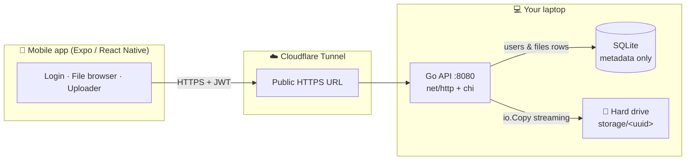

<div align="center">

# ☁️ CloudBox

**A self-hosted, privacy-first personal cloud — access the files on your own laptop from anywhere, on your phone.**

A Google Drive alternative you fully own: a Go API + SQLite serving files straight off your hard drive, a React Native (Expo) mobile app, and a Cloudflare Tunnel for secure global access.

[Architecture](#-architecture) · [Quick start](#-quick-start) · [Go global](#-go-global-access-from-anywhere) · [Android APK](#-android-app-apk) · [API](#-api-reference) · [Security](#-security-measures)


</div>

---

## ✨ Features

- 📤 **Upload any file** from your phone via streaming `multipart/form-data` (constant memory, any size).
- 📥 **Download & open** files through the native share/preview sheet.
- 🗂️ **Per-user file browser** with pull-to-refresh, live upload progress, and optimistic delete.
- 🔐 **JWT auth** with bcrypt-hashed passwords; the token is stored in the device Keychain/Keystore.
- 🧱 **Bare-metal storage** — your files live as opaque blobs on *your* hard drive; only metadata goes in SQLite.
- 🌍 **Access from anywhere** over a secure public HTTPS URL via Cloudflare Tunnel (or deploy to Render).
- 🪶 **Tiny footprint** — a single static Go binary, no CGO, no heavy ORM, no external database.

## 🏗️ Architecture



**The core idea:** *metadata and bytes live in two different places.* SQLite stores **who owns what and what it's called**; the disk stores **the actual content under an opaque UUID filename**. That split is what makes the system secure (no path-traversal), fast (indexed lookups), and cheap (no blobs in the DB).

## 🧰 Tech stack

| Layer | Choice | Why |
|---|---|---|
| API & routing | **Go** (`net/http` + `go-chi/chi`) | Fast, single static binary, great stdlib HTTP |
| Metadata DB | **SQLite** via `database/sql` (`modernc.org/sqlite`) | Pure-Go (no CGO), zero-ops, perfect for small relational metadata |
| File storage | **Local disk** (bare-metal) | Right tool for large sequential I/O; you own the data |
| Mobile | **React Native + Expo** (TypeScript, Expo Router) | One codebase, OTA-friendly, native modules without Xcode/Android Studio |
| Secure storage | **expo-secure-store** | Hardware-backed Keychain / Keystore for the JWT |
| Global access | **Cloudflare Tunnel** / Ngrok (or Render) | Secure public HTTPS without opening router ports |

## 📁 Repository structure

```
cloudbox/
├── backend/                     # Go API + file manager
│   ├── cmd/server/main.go       # entrypoint: config → db → router → serve
│   ├── internal/
│   │   ├── config/              # env-based configuration
│   │   ├── database/            # SQLite connection, pragmas, schema.sql
│   │   ├── models/              # User, File structs
│   │   ├── auth/                # bcrypt + JWT (HS256)
│   │   ├── middleware/          # Bearer-token auth → injects user_id
│   │   ├── storage/             # the only code that touches the filesystem
│   │   └── handlers/            # register, login, upload, list, download, delete
│   └── Dockerfile               # static image (optional Render deploy)
├── mobile/                      # React Native (Expo) app
│   ├── app/                     # expo-router screens: (auth)/ + (app)/
│   └── src/                     # api client, auth context, components, theme
├── render.yaml                  # optional Render Blueprint
└── README.md
```

## 🚀 Quick start

### Prerequisites
- [Go](https://go.dev/dl/) 1.23+
- [Node.js](https://nodejs.org/) 20+ and the [Expo Go](https://expo.dev/go) app on your phone

### 1. Run the backend

```bash
cd backend
# set a strong signing secret (anything long & random)
export JWT_SECRET="$(openssl rand -base64 48)"   # PowerShell: see backend/.env.example
go run ./cmd/server
```

The server starts on `http://localhost:8080`, creating `data/cloudbox.db` and a `storage/` folder. Verify:

```bash
curl http://localhost:8080/health     # {"status":"ok",...}
```

### 2. Run the mobile app

A phone can't reach your laptop via `localhost`, so point the app at your laptop's LAN IP:

```bash
cd mobile
npm install
echo "EXPO_PUBLIC_API_URL=http://<YOUR-LAN-IP>:8080" > .env   # e.g. 192.168.1.20
npx expo start
```

Scan the QR code with **Expo Go** (phone and laptop on the same Wi-Fi). Register → upload → done.

> On Windows you may need to allow the server through the firewall the first time, and ensure your Wi-Fi is a *Private* network.

## 🌍 Go global (access from anywhere)

### Option A — Cloudflare Tunnel (recommended; files stay on your laptop)

A tunnel gives your local server a public HTTPS URL without opening any router ports. **Quick tunnel** (no account, ephemeral URL):

```bash
# 1. keep the backend running:  go run ./cmd/server
# 2. in another terminal:
cloudflared tunnel --url http://localhost:8080
```

It prints a URL like `https://random-words.trycloudflare.com`. Put that in `mobile/.env`:

```
EXPO_PUBLIC_API_URL=https://random-words.trycloudflare.com
```

For a **stable URL on your own domain**, create a named tunnel (free Cloudflare account):

```bash
cloudflared tunnel login
cloudflared tunnel create cloudbox
cloudflared tunnel route dns cloudbox cloudbox.yourdomain.com
cloudflared tunnel run --url http://localhost:8080 cloudbox
```

> Prefer Ngrok? `ngrok http 8080` works the same way.

### Option B — Deploy to Render (no laptop required)

Push this repo to GitHub, then **Render → New → Blueprint → pick your repo**. It reads [`render.yaml`](render.yaml) and builds [`backend/Dockerfile`](backend/Dockerfile).

> ⚠️ **Free instances have an ephemeral filesystem** — uploaded files and the SQLite DB are wiped on every restart/redeploy, and the service sleeps after ~15 min idle. For durable storage, use a paid plan and uncomment the `disk:` block in `render.yaml`.

## 📦 Android app (APK)

Build a sideloadable APK in the cloud with [EAS Build](https://docs.expo.dev/build/introduction/) (free tier, needs a free Expo account):

```bash
cd mobile
npm install -g eas-cli      # or: npx eas-cli@latest
eas login
eas build -p android --profile preview
```

When it finishes, EAS prints a download link to a `.apk`. Download it, then on your phone enable **Install unknown apps** and open the file. To distribute it, attach the `.apk` to a **GitHub Release**:

```bash
gh release create v1.0.0 cloudbox.apk --title "CloudBox v1.0.0" --notes "First release"
```

> Make sure `EXPO_PUBLIC_API_URL` points at your tunnel/Render URL **before** building, since it's inlined into the binary.

## 📡 API reference

All `/files*` and `/me` routes require an `Authorization: Bearer <token>` header.

| Method | Path | Body | Description |
|---|---|---|---|
| `GET` | `/health` | – | Liveness + DB check |
| `POST` | `/register` | `{ email, password }` | Create account → `{ token, user }` |
| `POST` | `/login` | `{ email, password }` | Authenticate → `{ token, user }` |
| `GET` | `/me` | – | Current user profile |
| `POST` | `/upload` | `multipart/form-data` field `file` | Upload a file → file metadata |
| `GET` | `/files` | – | List the caller's files (newest first) |
| `GET` | `/files/{id}/download` | – | Stream one of the caller's files |
| `DELETE` | `/files/{id}` | – | Delete one of the caller's files |

## ⚙️ Configuration

The backend is configured entirely through environment variables (see [`backend/.env.example`](backend/.env.example)):

| Variable | Default | Description |
|---|---|---|
| `PORT` | `8080` | HTTP port to listen on |
| `DATABASE_URL` | `./data/cloudbox.db` | Path to the SQLite file |
| `STORAGE_DIR` | `./storage` | Directory for file blobs |
| `JWT_SECRET` | *(dev default)* | **Set a long random value in production** — anyone with it can forge tokens |
| `MAX_UPLOAD_BYTES` | `2147483648` | Max single-upload size (2 GiB) |

## 🛡️ Security measures

- **Passwords** are hashed with **bcrypt** (per-password salt, tunable work factor) — never stored in plaintext.
- **JWT verification pins the algorithm** to HMAC, blocking the `alg:none` / algorithm-confusion attacks.
- **Directory-traversal proof:** uploaded files are saved under a server-generated **UUID**, never the client's filename — a malicious name like `../../etc/passwd` is only ever stored as harmless display metadata.
- **Per-user isolation:** every file query is scoped `WHERE user_id = ?` (from the verified token); another user's file returns `404`, never a leak.
- **No account enumeration:** login returns one generic error for both "unknown email" and "wrong password", with timing equalized via a dummy bcrypt comparison.
- **Upload size cap** via `MaxBytesReader` so one client can't fill the disk.

## 🗺️ Roadmap

- [ ] Folders / nested paths
- [ ] Resumable downloads (HTTP range requests)
- [ ] Thumbnails & in-app previews
- [ ] Shareable public links with expiry
- [ ] Refresh tokens + token revocation

## 🤝 Contributing

Issues and PRs welcome! This project is intentionally small and readable — a great place to learn full-stack + systems design.

## 📄 License

[MIT](LICENSE) © 2026 VEER-TARGARYEN
