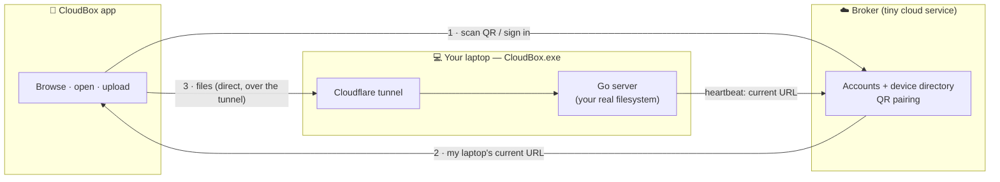

<div align="center">

# ☁️ CloudBox

**Your laptop's files, on your phone, from anywhere — by scanning a QR code.**

A self-hosted, privacy-first personal cloud. Install a tiny app on your laptop, scan a QR with your phone, and browse, open, and upload **any file on your PC** over a secure connection. Your files never leave your machine.

[Install](#-get-started-3-steps) · [How it works](#-how-it-works) · [Run from source](#-run-from-source-developers) · [Self-host the broker](#-self-host-your-own-broker) · [Security](#-security)


</div>

---

## ✨ Features

- 📁 **Access your whole PC** — Downloads, Documents, `C:\`, every drive — not just one folder.
- 📷 **One-scan pairing** — scan a QR on your laptop; no IP addresses, no URLs to copy.
- 🔗 **Permanent link** — the connection survives reboots and changing networks (the broker tracks where your laptop is).
- 📥 **Open & share** — tap a file to open it in the right app, or share it onward.
- 📤 **Upload** from your phone straight into any folder, with live progress.
- 🔐 **Yours only** — JWT auth, hardware-backed token storage, path-traversal protection; files stay on your hardware.
- 🪶 **Tiny & self-hostable** — a single Go binary on the laptop, an Expo app on the phone, and an optional lightweight cloud broker you can run yourself.

## 🚀 Get started (3 steps)

> Works today on **Windows** (laptop) + **Android** (phone).

1. **On your laptop:** download **`CloudBox-Setup.exe`** from the [Releases](https://github.com/VEER-TARGARYEN/cloudbox/releases) page and run it. Click **Start CloudBox** — a setup page opens in your browser. **Create an account**, and a **QR code** appears.
2. **On your phone:** install **`cloudbox.apk`** (also on [Releases](https://github.com/VEER-TARGARYEN/cloudbox/releases) → enable "Install unknown apps" when prompted).
3. **Open the app → Scan QR code → point it at your laptop screen.** Done — you're browsing your PC. 🎉

Keep the laptop window open while you use the app. That's it.

## 🏗️ How it works



- The **laptop app** opens a secure Cloudflare tunnel and tells the **broker** "I'm at this URL" (re-reporting whenever it changes).
- Your **phone** asks the broker "where's my laptop?" — by scanning the QR (or signing in) — then talks to the laptop **directly** for files.
- The broker is just a small **directory + pairing** service. It never sees your files; it only knows *where* your laptop is.

## 🧰 Tech stack

| Part | Stack | Role |
|---|---|---|
| **Laptop app** | Go (`net/http` + chi), SQLite, bundled `cloudflared` | Serves your real filesystem; self-contained `.exe` |
| **Mobile app** | React Native + Expo (TypeScript, Expo Router) | Browse / open / upload; QR scanner; secure token storage |
| **Broker** | Go + SQLite, Docker | Verified accounts + device directory + QR pairing |
| **Transport** | Cloudflare Tunnel | Public HTTPS to the laptop without opening ports |

## 📁 Repository structure

```
cloudbox/
├── backend/      # the laptop app (Go): file server, setup UI, tunnel, broker link
├── mobile/       # the phone app (Expo / React Native)
├── broker/       # the cloud pairing service (Go) — deploy this once
├── installer/    # builds CloudBox-Setup.exe (Inno Setup)
└── render.yaml   # one-click broker deploy on Render
```

## 🧑‍💻 Run from source (developers)

**Prerequisites:** [Go](https://go.dev/dl/) 1.23+, [Node.js](https://nodejs.org/) 20+, [`cloudflared`](https://developers.cloudflare.com/cloudflare-one/connections/connect-networks/downloads/), and the [Expo Go](https://expo.dev/go) app.

**Laptop server** (spawns its own tunnel + opens the setup UI):
```bash
cd backend
go run ./cmd/server
# → your browser opens http://127.0.0.1:8765 — sign in, get a QR
```

**Mobile app:**
```bash
cd mobile
npm install
# point "Sign in with email" at your broker (QR pairing carries it automatically):
echo "EXPO_PUBLIC_BROKER_URL=https://your-broker.onrender.com" > .env
npx expo start         # scan with Expo Go
```

**Build the Android APK** ([EAS](https://docs.expo.dev/build/introduction/), free Expo account):
```bash
cd mobile
npx eas-cli@latest build -p android --profile preview
```

**Build the Windows installer:**
```powershell
powershell -ExecutionPolicy Bypass -File installer\build.ps1
# → installer\Output\CloudBox-Setup.exe
```

## 🌐 Self-host your own broker

The broker is a tiny stateless-ish directory service. Deploy your own so you're not relying on anyone else's:

1. Push this repo to GitHub, then on [Render](https://render.com): **New ▸ Blueprint ▸ pick your repo**. It reads [`render.yaml`](render.yaml) and deploys [`broker/Dockerfile`](broker/Dockerfile). `JWT_SECRET` and the public URL are set automatically.
2. Build the APK with `EXPO_PUBLIC_BROKER_URL` pointing at your broker (only affects the "Sign in with email" default — **QR pairing already carries the broker URL**, so a single APK works with any broker).

> ⚠️ **Persistence:** Render's free tier has an ephemeral disk — accounts reset on restart. Fine for testing; for permanent accounts, attach a paid disk (see the commented block in `render.yaml`) or point `DATABASE_URL` at a hosted DB.
>
> ✉️ **Email:** with no SMTP configured, accounts are auto-verified (no email server, no dead end). Set `SMTP_*` (e.g. Resend/Brevo) to require real verification.

## 📡 Laptop API (reference)

All `/fs*` routes require a Bearer token (obtained by pairing).

| Method | Path | Description |
|---|---|---|
| `GET` | `/health` | Liveness |
| `POST` | `/auth/broker` | Exchange a broker token for a laptop token |
| `GET` | `/fs/roots` | Drives + Home/Downloads/Desktop/Documents |
| `GET` | `/fs/list?path=` | List a directory |
| `GET` | `/fs/download?path=` | Stream a real file |
| `POST` | `/fs/upload?path=` | Upload into a real folder |

## 🛡️ Security

- **Passwords** are bcrypt-hashed (broker side); the JWT is stored in the device Keychain/Keystore.
- **JWT verification pins the algorithm** (blocks `alg:none`/confusion attacks).
- **No path traversal:** every filesystem path is cleaned, must be absolute, and is checked against an allow-list (`FS_ALLOW_ROOTS`, default = full access; `FS_READONLY` to forbid writes).
- **Federated login:** the laptop validates a phone's broker token via the broker (introspection) and only accepts it for its owner.
- **The broker never sees your files** — only your laptop's current URL.

> ⚠️ CloudBox exposes your PC's filesystem over the internet by design. Use a strong password, keep `FS_ALLOW_ROOTS`/`FS_READONLY` in mind, and run your own broker for full control.

## 🗺️ Roadmap

- [ ] macOS / Linux laptop builds
- [ ] In-app thumbnails & previews
- [ ] Multiple linked laptops per account
- [ ] Short-lived / rotating pairing codes
- [ ] Real-email verification by default

## 🤝 Contributing

Issues and PRs welcome — it's a compact, readable full-stack + systems-design project. See the per-folder `README`s.

## 📄 License

[MIT](LICENSE) © 2026 VEER-TARGARYEN
